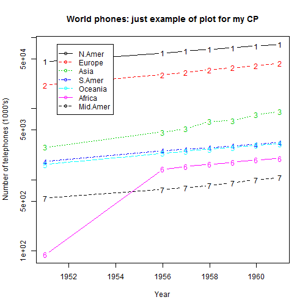

## Description of WorldPhones dataset

1. The number of telephones in various regions of the world (in thousands).
2. Standard Dataset from 
3. Usage of Dataset  require call of: library(datasets)


--- .class #id 

## Format of dataset

1. A matrix with 7 rows and 8 columns. The columns of the matrix give the figures for a given region, and the rows the figures for a year.
2. The regions are: North America, Europe, Asia, South America, Oceania, Africa, Central America.
3. The years are: 1951, 1956, 1957, 1958, 1959, 1960, 1961.
4. Source: AT&T (1961) The World's Telephones.

Chech your watches: 2015-06-20 15:48:26. The dataset is based on more then 60 years old data. 

---

## Example of Graphs on the Dataset


```r
require(graphics)
matplot(rownames(WorldPhones), WorldPhones, type = "b", log = "y", xlab = "Year", ylab = "Number of telephones (1000's)")
legend(1951.5, 80000, colnames(WorldPhones), col = 1:6, lty = 1:5, pch = rep(21, 7))
title(main = "World phones: just example of plot for my CP")
```

 

---

## Results of Course Project

Major result of the Course project has to be to show that: 

1. I am able to create at least most primitive **Shiny** application (DONE!)
2. I am able to publish the applications on __shinyapps.io__ portal (DONE!)
3. I am able to create presentation using both _Slidify_ and _R Presenter_ (DONE!)
4. I am able to link accounts and to publish the presentation on _RPubs__ (DONE!)

I am sorry for the fact that the application itself is an extemelly primitive. It is because of the fact that I have focused on understanding how _Shiny_ and _Slidify_ are working.  


